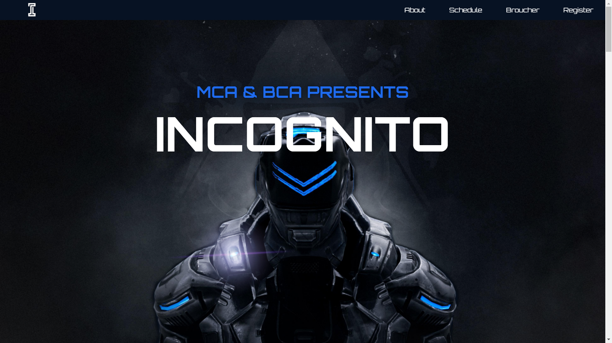
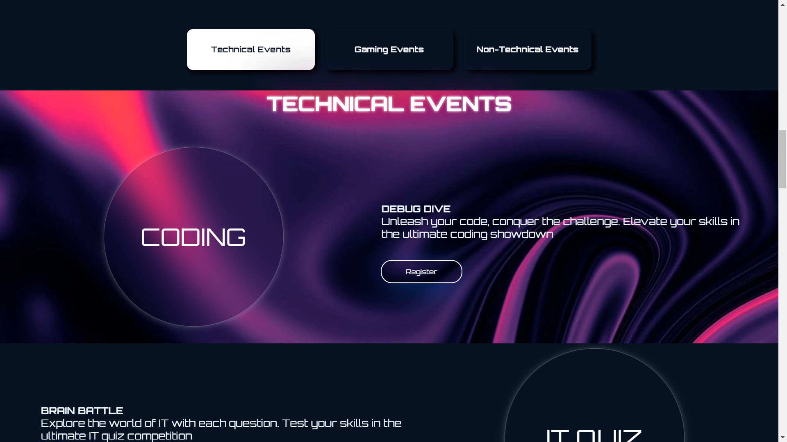
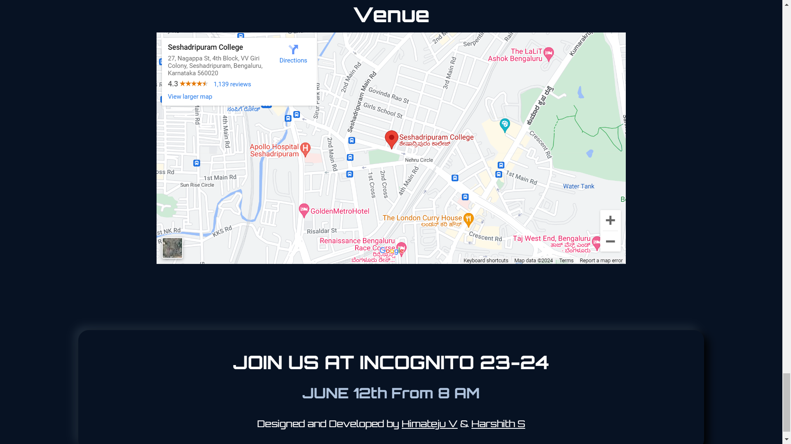
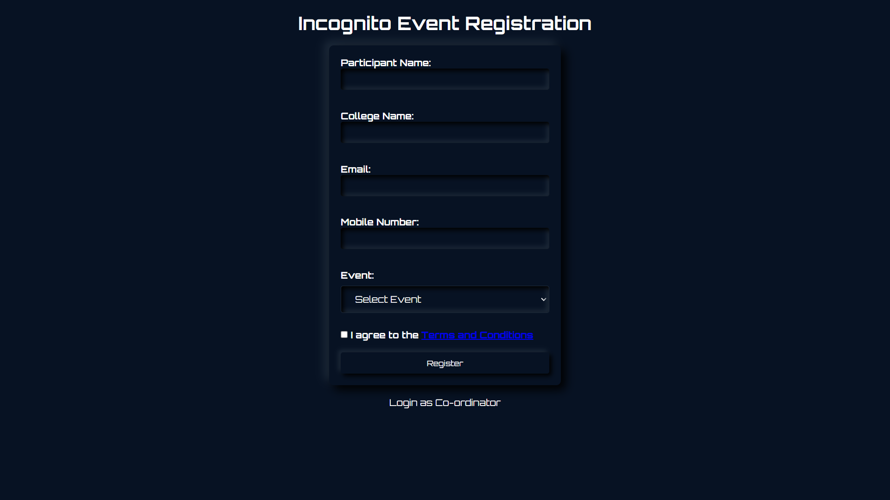

# INCOGNITO Technical Fest Website

This repository contains the codebase for **INCOGNITO**, an annual technical fest organized by the Department of Computer Science at Seshadripuram College. The website is designed to facilitate event registration and provide information about various events happening during the fest.

## :rocket: Features

- Co-ordinator's authentication using Firebase Authentication.
- Realtime event registration and management through Firebase Realtime Database.
- Responsive design implemented with HTML, CSS, and JavaScript.
- Hosted on Cloudflare for fast and reliable performance.

## :computer: UI Styles

- Parallax scrolling
- Neumorphism
- Glassmorphism

## :settings: Technologies Used

- HTML5
- CSS3
- JavaScript
- Firebase (Authentication and Realtime Database)
- Cloudflare (Hosting)

## :movie_camera: App Screenshots

 
| Home Page | Events | Footer |
| :---         |     :---      |          :--- |
|   |     |     |

| Registration Page | 
| :---         | 
|   |

## Contact

Special thanks to [Harshith S](https://github.com/https://github.com/harshith8899) for contributions to the project!

Website Link: [https://incognito-2024.pages.dev/](https://incognito-2024.pages.dev/)
